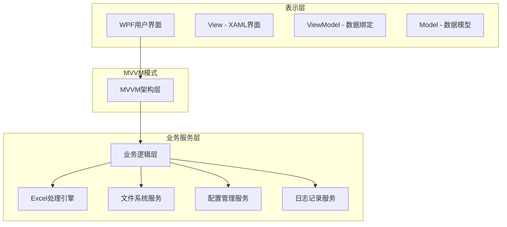
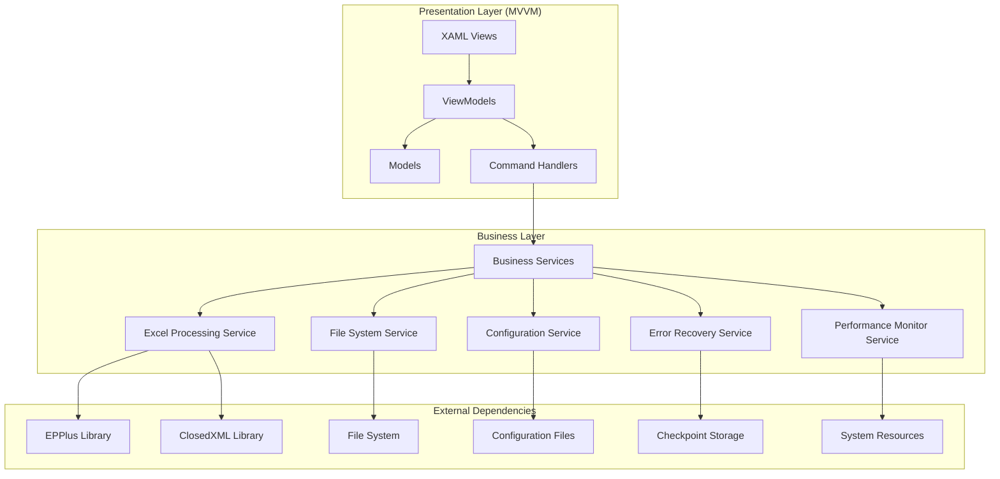
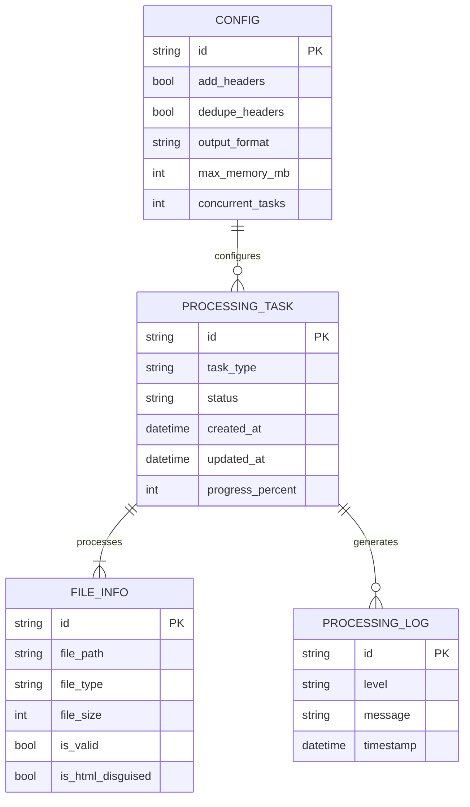

# Excel Tools Pro - 技术架构文档

## 1. 架构设计



## 2. 技术描述

* 框架：WPF (.NET 8.0)

* 编程语言：C# 12.0

* 架构模式：MVVM (Model-View-ViewModel)

* UI框架：Material Design In XAML Toolkit

* Excel处理：EPPlus + ClosedXML

* 异步处理：async/await + Task

* 依赖注入：Microsoft.Extensions.DependencyInjection

* 配置管理：Microsoft.Extensions.Configuration

* 日志记录：Serilog

## 3. 界面组件定义

| 组件类型        | 组件名称         | 用途                 |
| ----------- | ------------ | ------------------ |
| MainWindow  | 主窗口          | 应用程序主窗口，承载所有用户控件   |
| UserControl | HomeView     | 主界面，显示文件选择和操作控制面板  |
| UserControl | ProgressView | 处理进度界面，显示实时处理状态和日志 |
| UserControl | SettingsView | 设置界面，配置表头管理和性能选项   |
| UserControl | ErrorView    | 错误处理界面，显示错误详情和重试选项 |

## 4. 服务接口定义

### 4.1 核心服务接口

**文件处理服务**

```csharp
public interface IExcelProcessingService
{
    Task<ProcessingResult> MergeExcelFilesAsync(MergeRequest request);
    Task<ProcessingResult> SplitExcelFileAsync(SplitRequest request);
    Task<ValidationResult> ValidateExcelFilesAsync(string[] filePaths);
}
```

**合并Excel文件**

```csharp
public class MergeRequest
{
    public string[] FilePaths { get; set; }
    public string OutputPath { get; set; }
    public bool AddHeaders { get; set; }
    public bool DedupeHeaders { get; set; }
}

public class ProcessingResult
{
    public bool Success { get; set; }
    public string Message { get; set; }
    public string OutputFile { get; set; }
    public List<string> Errors { get; set; }
}
```

使用示例：

```csharp
var request = new MergeRequest
{
    FilePaths = new[] { @"C:\data\file1.xlsx", @"C:\data\file2.xlsx" },
    OutputPath = @"C:\output\merged.xlsx",
    AddHeaders = true,
    DedupeHeaders = true
};

var result = await excelService.MergeExcelFilesAsync(request);
```

**拆分Excel文件**

```csharp
public class SplitRequest
{
    public string FilePath { get; set; }
    public string OutputDirectory { get; set; }
    public SplitMode SplitBy { get; set; }
    public int? RowsPerFile { get; set; }
}

public enum SplitMode
{
    BySheet,
    ByRows
}
```

**文件验证服务**

```csharp
public class ValidationResult
{
    public string[] ValidFiles { get; set; }
    public string[] InvalidFiles { get; set; }
    public string[] HtmlFiles { get; set; }
    public Dictionary<string, string> FileErrors { get; set; }
}
```

### 4.2 鲁棒性相关服务

**错误恢复和重试服务**

```csharp
public interface IErrorRecoveryService
{
    Task<RetryResult> RetryFailedOperationAsync(string taskId, RetryOptions options = null);
    Task<CheckpointInfo> GetProcessingCheckpointAsync(string taskId);
    Task<CleanupResult> CleanupTempFilesAsync(string taskId = null);
}

public class RetryResult
{
    public bool Success { get; set; }
    public string NewTaskId { get; set; }
    public string Message { get; set; }
}

public class RetryOptions
{
    public int MaxRetries { get; set; } = 3;
    public TimeSpan RetryDelay { get; set; } = TimeSpan.FromSeconds(1);
    public bool UseExponentialBackoff { get; set; } = true;
}
```

**检查点和清理服务**

```csharp
public class CheckpointInfo
{
    public ProcessingCheckpoint Checkpoint { get; set; }
    public bool CanResume { get; set; }
}

public class CleanupResult
{
    public string[] CleanedFiles { get; set; }
    public long FreedSpaceMB { get; set; }
}
```

**性能监控服务**

```csharp
public interface IPerformanceMonitorService
{
    Task<SystemMetrics> GetSystemMetricsAsync();
    Task<bool> UpdatePerformanceSettingsAsync(PerformanceSettings settings);
    event EventHandler<SystemMetrics> MetricsUpdated;
}

public class SystemMetrics
{
    public float MemoryUsagePercent { get; set; }
    public float CpuUsagePercent { get; set; }
    public double AvailableDiskSpaceGB { get; set; }
    public float ProcessingSpeedFilesPerMin { get; set; }
    public DateTime Timestamp { get; set; }
}

public class PerformanceSettings
{
    public int MaxMemoryMB { get; set; } = 512;
    public int MaxConcurrentFiles { get; set; } = 2;
    public bool EnableAutoThrottle { get; set; } = true;
}
```

## 5. 应用程序架构图



## 6. 鲁棒性设计

### 6.1 错误处理机制

**文件格式处理**

* 支持多种Excel格式混合处理（.xlsx, .xls, .csv）

* 自动检测并处理伪装成.xls的HTML文件

* 文件格式不匹配时提供格式转换建议

* 损坏文件检测和修复尝试

**权限和访问控制**

* 文件读写权限检查

* 文件占用状态检测

* 网络驱动器文件处理优化

* 临时文件权限管理

**错误分类和处理策略**

```csharp
public enum ProcessingErrorType
{
    FileNotFound,
    PermissionDenied,
    CorruptedFile,
    UnsupportedFormat,
    InsufficientMemory,
    NetworkError,
    UnexpectedError
}

public class ProcessingError : Exception
{
    public ProcessingErrorType ErrorType { get; }
    public string FilePath { get; }
    
    public ProcessingError(ProcessingErrorType errorType, string message, string filePath = null) 
        : base(message)
    {
        ErrorType = errorType;
        FilePath = filePath;
    }
    
    public bool IsRecoverable => ErrorType switch
    {
        ProcessingErrorType.NetworkError => true,
        ProcessingErrorType.InsufficientMemory => true,
        _ => false
    };
    
    public RetryStrategy GetRetryStrategy() => ErrorType switch
    {
        ProcessingErrorType.NetworkError => RetryStrategy.ExponentialBackoff,
        ProcessingErrorType.InsufficientMemory => RetryStrategy.ReduceMemoryUsage,
        _ => RetryStrategy.NoRetry
    };
}

public enum RetryStrategy
{
    NoRetry,
    ExponentialBackoff,
    ReduceMemoryUsage
}
```

### 6.2 数据验证策略

**Excel结构验证**

* 工作表结构一致性检查

* 列数和数据类型匹配验证

* 表头格式标准化处理

* 空工作表和隐藏工作表处理

**数据类型检查**

* 自动数据类型推断和转换

* 日期格式统一处理

* 数值精度保持

* 文本编码检测和转换（UTF-8, GBK, ASCII）

**数据完整性验证**

```csharp
public class DataValidator
{
    public int MaxRows { get; set; } = 1000000;
    public int MaxColumns { get; set; } = 16384;
    public List<string> AllowedEncodings { get; set; } = new() { "UTF-8", "GBK", "ASCII" };
    public List<string> DateFormats { get; set; } = new() { "yyyy-MM-dd", "MM/dd/yyyy", "dd/MM/yyyy" };
    
    public async Task<ValidationResult> ValidateWorkbookAsync(ExcelPackage package)
    {
        var issues = new List<ValidationIssue>();
        
        foreach (var worksheet in package.Workbook.Worksheets)
        {
            if (worksheet.Dimension?.Rows > MaxRows)
            {
                issues.Add(new ValidationIssue
                {
                    Type = ValidationIssueType.TooManyRows,
                    SheetName = worksheet.Name,
                    Message = $"工作表 '{worksheet.Name}' 行数超过限制 ({MaxRows})"
                });
            }
            
            if (worksheet.Dimension?.Columns > MaxColumns)
            {
                issues.Add(new ValidationIssue
                {
                    Type = ValidationIssueType.TooManyColumns,
                    SheetName = worksheet.Name,
                    Message = $"工作表 '{worksheet.Name}' 列数超过限制 ({MaxColumns})"
                });
            }
        }
        
        return new ValidationResult { Issues = issues };
    }
}

public class ValidationIssue
{
    public ValidationIssueType Type { get; set; }
    public string SheetName { get; set; }
    public string Message { get; set; }
}

public enum ValidationIssueType
{
    TooManyRows,
    TooManyColumns,
    InvalidDataType,
    MissingHeaders,
    DuplicateHeaders
}
```

### 6.3 容错机制

**部分失败处理**

* 单个文件失败不影响整体处理

* 失败文件跳过并记录详细日志

* 成功处理的文件正常输出

* 提供失败文件重试选项

**内存管理**

* 大文件分块处理

* 内存使用监控和限制

* 自动垃圾回收触发

* 内存不足时的降级处理策略

**资源管理**

```csharp
public class ResourceManager
{
    public int MaxMemoryMB { get; set; } = 512;
    public int MaxConcurrentFiles { get; set; } = 2;
    public int ChunkSize { get; set; } = 1024 * 1024; // 1MB
    public string TempDirectory { get; set; } = Path.GetTempPath();
    
    private readonly SemaphoreSlim _semaphore;
    private readonly ILogger<ResourceManager> _logger;
    
    public ResourceManager(ILogger<ResourceManager> logger)
    {
        _logger = logger;
        _semaphore = new SemaphoreSlim(MaxConcurrentFiles, MaxConcurrentFiles);
    }
    
    public async Task<List<ProcessingResult<T>>> ProcessWithLimitsAsync<T>(
        IEnumerable<string> filePaths,
        Func<string, CancellationToken, Task<T>> processor,
        CancellationToken cancellationToken = default)
    {
        var results = new List<ProcessingResult<T>>();
        var tasks = new List<Task<ProcessingResult<T>>>();
        
        foreach (var filePath in filePaths)
        {
            tasks.Add(ProcessSingleFileAsync(filePath, processor, cancellationToken));
        }
        
        var completedResults = await Task.WhenAll(tasks);
        results.AddRange(completedResults);
        
        return results;
    }
    
    private async Task<ProcessingResult<T>> ProcessSingleFileAsync<T>(
        string filePath,
        Func<string, CancellationToken, Task<T>> processor,
        CancellationToken cancellationToken)
    {
        await _semaphore.WaitAsync(cancellationToken);
        
        try
        {
            // 检查内存使用情况
            if (GC.GetTotalMemory(false) > MaxMemoryMB * 1024 * 1024)
            {
                GC.Collect();
                GC.WaitForPendingFinalizers();
            }
            
            var result = await processor(filePath, cancellationToken);
            return new ProcessingResult<T> { Success = true, Data = result, FilePath = filePath };
        }
        catch (Exception ex)
        {
            _logger.LogError(ex, "处理文件失败: {FilePath}", filePath);
            return new ProcessingResult<T> 
            { 
                Success = false, 
                Error = ex.Message, 
                FilePath = filePath 
            };
        }
        finally
        {
            _semaphore.Release();
        }
    }
}

public class ProcessingResult<T>
{
    public bool Success { get; set; }
    public T Data { get; set; }
    public string Error { get; set; }
    public string FilePath { get; set; }
}
```

### 6.4 异常恢复机制

**处理中断恢复**

* 处理进度持久化存储

* 中断点自动检测和恢复

* 部分完成任务的状态保存

* 用户手动恢复选项

**临时文件管理**

* 自动临时文件清理

* 异常退出时的清理机制

* 临时文件大小监控

* 磁盘空间不足处理

**状态回滚**

```csharp
public class ProcessingCheckpoint
{
    public string TaskId { get; set; }
    public List<string> CompletedFiles { get; set; } = new();
    public string CurrentFile { get; set; }
    public float ProgressPercent { get; set; }
    public DateTime Timestamp { get; set; }
    public List<string> TempFiles { get; set; } = new();
    
    private static readonly string CheckpointDirectory = 
        Path.Combine(Environment.GetFolderPath(Environment.SpecialFolder.LocalApplicationData), 
                     "ExcelToolsPro", "Checkpoints");
    
    public async Task SaveAsync()
    {
        try
        {
            Directory.CreateDirectory(CheckpointDirectory);
            var checkpointPath = GetCheckpointPath();
            var json = JsonSerializer.Serialize(this, new JsonSerializerOptions 
            { 
                WriteIndented = true,
                PropertyNamingPolicy = JsonNamingPolicy.CamelCase
            });
            
            await File.WriteAllTextAsync(checkpointPath, json);
        }
        catch (Exception ex)
        {
            throw new InvalidOperationException($"保存检查点失败: {ex.Message}", ex);
        }
    }
    
    public static async Task<ProcessingCheckpoint> LoadAsync(string taskId)
    {
        try
        {
            var checkpointPath = GetCheckpointPathForTask(taskId);
            if (!File.Exists(checkpointPath))
                return null;
                
            var json = await File.ReadAllTextAsync(checkpointPath);
            return JsonSerializer.Deserialize<ProcessingCheckpoint>(json, new JsonSerializerOptions
            {
                PropertyNamingPolicy = JsonNamingPolicy.CamelCase
            });
        }
        catch (Exception ex)
        {
            throw new InvalidOperationException($"加载检查点失败: {ex.Message}", ex);
        }
    }
    
    public async Task CleanupTempFilesAsync()
    {
        var cleanupTasks = TempFiles.Select(async tempFile =>
        {
            try
            {
                if (File.Exists(tempFile))
                {
                    await Task.Run(() => File.Delete(tempFile));
                }
            }
            catch (Exception ex)
            {
                // 记录日志但不抛出异常
                System.Diagnostics.Debug.WriteLine($"清理临时文件失败: {tempFile}, 错误: {ex.Message}");
            }
        });
        
        await Task.WhenAll(cleanupTasks);
    }
    
    private string GetCheckpointPath() => GetCheckpointPathForTask(TaskId);
    
    private static string GetCheckpointPathForTask(string taskId) => 
        Path.Combine(CheckpointDirectory, $"{taskId}.checkpoint.json");
}
```

### 6.5 性能监控和资源管理

**性能指标监控**

* 内存使用率实时监控

* CPU使用率跟踪

* 磁盘I/O性能监控

* 处理速度统计

**自适应性能调优**

* 根据系统资源动态调整并发数

* 内存压力下的处理策略切换

* 大文件检测和特殊处理

* 网络文件访问优化

```csharp
public class PerformanceMonitor : IDisposable
{
    public float MemoryThreshold { get; set; } = 0.8f; // 内存使用阈值 (0.0-1.0)
    public float CpuThreshold { get; set; } = 0.9f;    // CPU使用阈值 (0.0-1.0)
    public TimeSpan IoTimeout { get; set; } = TimeSpan.FromMinutes(5); // I/O超时时间
    
    private readonly PerformanceCounter _memoryCounter;
    private readonly PerformanceCounter _cpuCounter;
    private readonly Timer _monitoringTimer;
    private readonly ILogger<PerformanceMonitor> _logger;
    
    public event EventHandler<SystemMetrics> MetricsUpdated;
    
    public PerformanceMonitor(ILogger<PerformanceMonitor> logger)
    {
        _logger = logger;
        _memoryCounter = new PerformanceCounter("Memory", "Available MBytes");
        _cpuCounter = new PerformanceCounter("Processor", "% Processor Time", "_Total");
        
        _monitoringTimer = new Timer(UpdateMetrics, null, TimeSpan.Zero, TimeSpan.FromSeconds(5));
    }
    
    public SystemMetrics GetSystemMetrics()
    {
        var totalMemory = GC.GetTotalMemory(false);
        var availableMemory = _memoryCounter.NextValue() * 1024 * 1024; // Convert MB to bytes
        var memoryUsage = (float)(totalMemory / (totalMemory + availableMemory));
        
        return new SystemMetrics
        {
            MemoryUsagePercent = memoryUsage * 100,
            CpuUsagePercent = _cpuCounter.NextValue(),
            AvailableDiskSpaceGB = GetAvailableDiskSpace(),
            ProcessingSpeedFilesPerMin = CalculateProcessingSpeed(),
            Timestamp = DateTime.Now
        };
    }
    
    public bool ShouldThrottle()
    {
        var metrics = GetSystemMetrics();
        return metrics.MemoryUsagePercent / 100 > MemoryThreshold || 
               metrics.CpuUsagePercent / 100 > CpuThreshold;
    }
    
    private void UpdateMetrics(object state)
    {
        try
        {
            var metrics = GetSystemMetrics();
            MetricsUpdated?.Invoke(this, metrics);
        }
        catch (Exception ex)
        {
            _logger.LogError(ex, "更新性能指标失败");
        }
    }
    
    private double GetAvailableDiskSpace()
    {
        var drive = new DriveInfo(Path.GetPathRoot(Environment.CurrentDirectory));
        return drive.AvailableFreeSpace / (1024.0 * 1024.0 * 1024.0); // Convert to GB
    }
    
    private float CalculateProcessingSpeed()
    {
        // 实现处理速度计算逻辑
        return 0.0f; // 占位符
    }
    
    public void Dispose()
    {
        _monitoringTimer?.Dispose();
        _memoryCounter?.Dispose();
        _cpuCounter?.Dispose();
    }
}
```

### 6.6 日志记录和调试支持

**分级日志系统**
- ERROR: 严重错误和异常
- WARN: 警告和可恢复错误
- INFO: 重要操作和状态变化
- DEBUG: 详细调试信息
- TRACE: 最详细的执行跟踪

**结构化日志格式**
```csharp
public class LogEntry
{
    public DateTime Timestamp { get; set; }
    public LogLevel Level { get; set; }
    public string Module { get; set; }
    public string Message { get; set; }
    public Dictionary<string, object> Context { get; set; } = new();
    public string TaskId { get; set; }
    public string FilePath { get; set; }
    
    public static LogEntry Error(string module, string message)
    {
        return new LogEntry
        {
            Timestamp = DateTime.UtcNow,
            Level = LogLevel.Error,
            Module = module,
            Message = message
        };
    }
    
    public LogEntry WithContext(string key, object value)
    {
        Context[key] = value;
        return this;
    }
    
    public LogEntry WithTaskId(string taskId)
    {
        TaskId = taskId;
        return this;
    }
    
    public LogEntry WithFilePath(string filePath)
    {
        FilePath = filePath;
        return this;
    }
}

public enum LogLevel
{
    Trace,
    Debug,
    Information,
    Warning,
    Error,
    Critical
}
```

**调试和诊断工具**
- 详细的错误堆栈跟踪
- 文件处理步骤记录
- 性能瓶颈识别
- 内存泄漏检测
- 用户操作审计日志

## 7. 数据模型

### 7.1 数据模型定义



### 7.2 数据定义语言

**配置类 (C#)**

```csharp
public class AppConfig
{
    public bool AddHeaders { get; set; } = true;
    public bool DedupeHeaders { get; set; } = true;
    public string OutputFormat { get; set; } = "xlsx";
    public int MaxMemoryMB { get; set; } = 512;
    public int ConcurrentTasks { get; set; } = 2;
    public string LastOutputDirectory { get; set; }
    
    // UI设置
    public bool EnableDarkMode { get; set; } = false;
    public string Language { get; set; } = "zh-CN";
    public bool MinimizeToTray { get; set; } = true;
    
    // 性能设置
    public bool EnableAutoThrottle { get; set; } = true;
    public int ChunkSize { get; set; } = 1024 * 1024; // 1MB
    public TimeSpan ProcessingTimeout { get; set; } = TimeSpan.FromMinutes(30);
}
```

**文件信息类 (C#)**

```csharp
public class FileInfo
{
    public string Path { get; set; }
    public string Name { get; set; }
    public long Size { get; set; }
    public FileType FileType { get; set; }
    public bool IsValid { get; set; }
    public bool IsHtmlDisguised { get; set; }
    public int? SheetCount { get; set; }
    public int? RowCount { get; set; }
    public DateTime LastModified { get; set; }
    public string ErrorMessage { get; set; }
}

public enum FileType
{
    Xlsx,
    Xls,
    Csv,
    Html,
    Unknown
}
```

**处理任务类 (C#)**

```csharp
public class ProcessingTask : INotifyPropertyChanged
{
    private TaskStatus _status;
    private float _progress;
    
    public string Id { get; set; } = Guid.NewGuid().ToString();
    public TaskType TaskType { get; set; }
    
    public TaskStatus Status
    {
        get => _status;
        set
        {
            _status = value;
            OnPropertyChanged();
        }
    }
    
    public float Progress
    {
        get => _progress;
        set
        {
            _progress = value;
            OnPropertyChanged();
        }
    }
    
    public List<FileInfo> InputFiles { get; set; } = new();
    public string OutputPath { get; set; }
    public AppConfig Config { get; set; }
    public DateTime CreatedAt { get; set; } = DateTime.UtcNow;
    public DateTime UpdatedAt { get; set; } = DateTime.UtcNow;
    public List<ProcessingLog> Logs { get; set; } = new();
    public CancellationTokenSource CancellationTokenSource { get; set; } = new();
    
    public event PropertyChangedEventHandler PropertyChanged;
    
    protected virtual void OnPropertyChanged([CallerMemberName] string propertyName = null)
    {
        PropertyChanged?.Invoke(this, new PropertyChangedEventArgs(propertyName));
    }
}

public enum TaskType
{
    Merge,
    Split
}

public enum TaskStatus
{
    Pending,
    Processing,
    Completed,
    Failed,
    Cancelled
}

public class ProcessingLog
{
    public DateTime Timestamp { get; set; }
    public LogLevel Level { get; set; }
    public string Message { get; set; }
    public string Details { get; set; }
}
```

